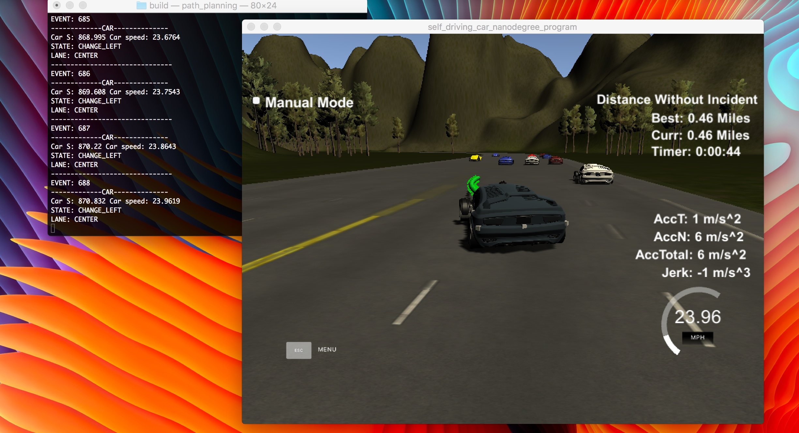

# CarND-Path-Planning-Project
Self-Driving Car Engineer Nanodegree Program

---

## Path Planning

The goal of this project is to build a path planner that creates smooth and safe trajectories for the car to follow. To achieve this goal it's been developed a complete and optimal trajectory planner which implements a Finite State Machine and makes decisions based on sensor fusion and localization data. The planner has to produce feasible, safe and legal trajectories which do not provoke any kind of penalties.



### Vehicle

This class is used to represent our self-driving car and others cars along the road. It implements two different constructors. The first one does not need any parameters to be passed when creating the instance and it's used to model our Self Driving Car. The second constructor accepts the localization data of the car and we call this method to create instances which represent the other cars in the road.

Our Self-Driving Car vehicle instance is updated every time the program receives a telemetry event from the simulator. The later explained path planner algorithm will use this information, combined with other cars data to estimate optimal trajectories for the car to follow.

### Road

The Road class instance stores the updated sensor fusion data and also implements some methods that help the planner to decide if a way is safe or/and free to drive in. The road instance has three protected properties which are vectors of Vehicles and they have information about the traffic on each way of the road.

### Map

Thanks to the spline.h script our map is based on interpolate points taken from the highway_map dataset. It allows us not to transform from Frenet to Cartesian coordinates at any time we need to send new points to the Motion Control. Instead of that, we just need to use the spline functions to get the Cartesian coordinates for our estimated Frenet points.

### Planner

This version of the planner is based on a pretty simple design. It models a four state FSM (START, KEEP_LANE, CHANGE_LEFT, and CHANGE_RIGHT). The START state is the initial one and the machine cannot come back to it at any time. Once the car has started, the standard and desired behavior is to stay in the same lane at maximum allowed speed.

In case there is another car on his trajectory it will try to change lanes. If the car's initial position is in the left lane, the car only will change lane to the right. The opposite applies when the car needs to change and it is driving in the right lane.

If the car finds itself in the center of the highway, it will try first, to change to the left lane. If that's not possible and the right lane is safe and free to move in, the movement will be to that lane.

Mentioned this, if at any time it cannot change lanes because it's not safe or the just because the way is not free, it will reduce the speed to the minimum of half of max speed to not collide with other cars.

All maneuvers (except when the car is started) are done in just two planner cycles, this is, 2 seconds.

These 4 states are driven by 4 actions (start_car, stay_on_lane, reduce_speed, change_lane).

The planner also implements a JMT (Jerk Minimizing Trajectory) generator in order to create and drive smooth and safe paths when the car needs to change lanes or just to stay in the same lane without spikes on the acceleration nor jerk values.

### Recap

The SD Car is completely able to complete a track lap driving at max speed when it is possible and avoiding at any value, any kind of collisions or unsafe maneuvers. There are some straightforward challenges to the future like creating a complete behavior planner based on classification algorithms which take into account the others car most likely future maneuvers and projected trajectories.

### Links
- [VIDEO](https://youtu.be/8PZLi5K1thE)

---

# UDACITY INSTRUCTIONS

### Simulator. You can download the Term3 Simulator BETA which contains the Path Planning Project from the [releases tab](https://github.com/udacity/self-driving-car-sim/releases).

In this project your goal is to safely navigate around a virtual highway with other traffic that is driving +-10 MPH of the 50 MPH speed limit. You will be provided the car's localization and sensor fusion data, there is also a sparse map list of waypoints around the highway. The car should try to go as close as possible to the 50 MPH speed limit, which means passing slower traffic when possible, note that other cars will try to change lanes too. The car should avoid hitting other cars at all cost as well as driving inside of the marked road lanes at all times, unless going from one lane to another. The car should be able to make one complete loop around the 6946m highway. Since the car is trying to go 50 MPH, it should take a little over 5 minutes to complete 1 loop. Also the car should not experience total acceleration over 10 m/s^2 and jerk that is greater than 50 m/s^3.

#### The map of the highway is in data/highway_map.txt
Each waypoint in the list contains  [x,y,s,dx,dy] values. x and y are the waypoint's map coordinate position, the s value is the distance along the road to get to that waypoint in meters, the dx and dy values define the unit normal vector pointing outward of the highway loop.

The highway's waypoints loop around so the frenet s value, distance along the road, goes from 0 to 6945.554.

## Basic Build Instructions

1. Clone this repo.
2. Make a build directory: `mkdir build && cd build`
3. Compile: `cmake .. && make`
4. Run it: `./path_planning`.

Here is the data provided from the Simulator to the C++ Program

#### Main car's localization Data (No Noise)

["x"] The car's x position in map coordinates

["y"] The car's y position in map coordinates

["s"] The car's s position in frenet coordinates

["d"] The car's d position in frenet coordinates

["yaw"] The car's yaw angle in the map

["speed"] The car's speed in MPH

#### Previous path data given to the Planner

//Note: Return the previous list but with processed points removed, can be a nice tool to show how far along
the path has processed since last time.

["previous_path_x"] The previous list of x points previously given to the simulator

["previous_path_y"] The previous list of y points previously given to the simulator

#### Previous path's end s and d values

["end_path_s"] The previous list's last point's frenet s value

["end_path_d"] The previous list's last point's frenet d value

#### Sensor Fusion Data, a list of all other car's attributes on the same side of the road. (No Noise)

["sensor_fusion"] A 2d vector of cars and then that car's [car's unique ID, car's x position in map coordinates, car's y position in map coordinates, car's x velocity in m/s, car's y velocity in m/s, car's s position in frenet coordinates, car's d position in frenet coordinates.

## Details

1. The car uses a perfect controller and will visit every (x,y) point it recieves in the list every .02 seconds. The units for the (x,y) points are in meters and the spacing of the points determines the speed of the car. The vector going from a point to the next point in the list dictates the angle of the car. Acceleration both in the tangential and normal directions is measured along with the jerk, the rate of change of total Acceleration. The (x,y) point paths that the planner recieves should not have a total acceleration that goes over 10 m/s^2, also the jerk should not go over 50 m/s^3. (NOTE: As this is BETA, these requirements might change. Also currently jerk is over a .02 second interval, it would probably be better to average total acceleration over 1 second and measure jerk from that.

2. There will be some latency between the simulator running and the path planner returning a path, with optimized code usually its not very long maybe just 1-3 time steps. During this delay the simulator will continue using points that it was last given, because of this its a good idea to store the last points you have used so you can have a smooth transition. previous_path_x, and previous_path_y can be helpful for this transition since they show the last points given to the simulator controller with the processed points already removed. You would either return a path that extends this previous path or make sure to create a new path that has a smooth transition with this last path.

## Tips

A really helpful resource for doing this project and creating smooth trajectories was using http://kluge.in-chemnitz.de/opensource/spline/, the spline function is in a single hearder file is really easy to use.

---

## Dependencies

* cmake >= 3.5
 * All OSes: [click here for installation instructions](https://cmake.org/install/)
* make >= 4.1
  * Linux: make is installed by default on most Linux distros
  * Mac: [install Xcode command line tools to get make](https://developer.apple.com/xcode/features/)
  * Windows: [Click here for installation instructions](http://gnuwin32.sourceforge.net/packages/make.htm)
* gcc/g++ >= 5.4
  * Linux: gcc / g++ is installed by default on most Linux distros
  * Mac: same deal as make - [install Xcode command line tools]((https://developer.apple.com/xcode/features/)
  * Windows: recommend using [MinGW](http://www.mingw.org/)
* [uWebSockets](https://github.com/uWebSockets/uWebSockets)
  * Run either `install-mac.sh` or `install-ubuntu.sh`.
  * If you install from source, checkout to commit `e94b6e1`, i.e.
    ```
    git clone https://github.com/uWebSockets/uWebSockets
    cd uWebSockets
    git checkout e94b6e1
    ```

## Editor Settings

We've purposefully kept editor configuration files out of this repo in order to
keep it as simple and environment agnostic as possible. However, we recommend
using the following settings:

* indent using spaces
* set tab width to 2 spaces (keeps the matrices in source code aligned)

## Code Style

Please (do your best to) stick to [Google's C++ style guide](https://google.github.io/styleguide/cppguide.html).

## Project Instructions and Rubric

Note: regardless of the changes you make, your project must be buildable using
cmake and make!


## Call for IDE Profiles Pull Requests

Help your fellow students!

We decided to create Makefiles with cmake to keep this project as platform
agnostic as possible. Similarly, we omitted IDE profiles in order to ensure
that students don't feel pressured to use one IDE or another.

However! I'd love to help people get up and running with their IDEs of choice.
If you've created a profile for an IDE that you think other students would
appreciate, we'd love to have you add the requisite profile files and
instructions to ide_profiles/. For example if you wanted to add a VS Code
profile, you'd add:

* /ide_profiles/vscode/.vscode
* /ide_profiles/vscode/README.md

The README should explain what the profile does, how to take advantage of it,
and how to install it.

Frankly, I've never been involved in a project with multiple IDE profiles
before. I believe the best way to handle this would be to keep them out of the
repo root to avoid clutter. My expectation is that most profiles will include
instructions to copy files to a new location to get picked up by the IDE, but
that's just a guess.

One last note here: regardless of the IDE used, every submitted project must
still be compilable with cmake and make./


1. Drive the car on the center lane
2. Respect max speed
3. Respect max acceleration
4. Respect max jerk
5. Change lanes algorithm
6. FSM
7. Modelize other vehicles (sensor fusion)
8. Create road
9. Check road every second to set some policies
